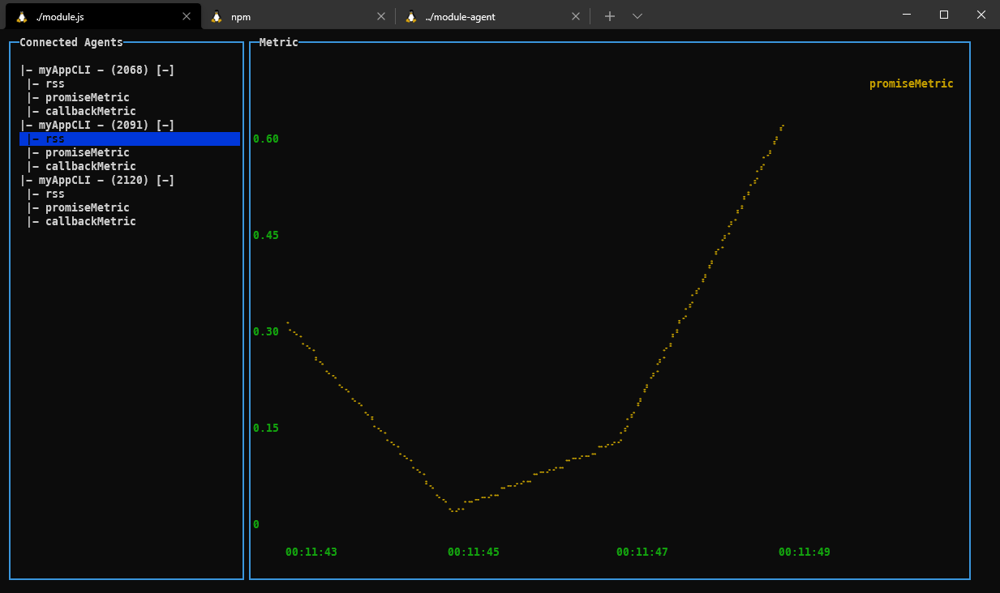

# PUB SUB - MQTT - SOCKETS

## Module CLI



## Installs others libraries

```
install ansible and vagrant

ansible

sudo apt-add-repository ppa:ansible/ansible

sudo apt-get update

sudo apt-get install ansible

ansible --version

vagrant

apt-get install virtualbox

apt-get install vagrant

vagrant -v
```

```
- postgresql:
sudo ansible-galaxy install ANXS.postgresql

- redis:
sudo ansible-galaxy install geerlingguy.redis

- NGINX:
sudo ansible-galaxy install jdauphant.nginx
```
